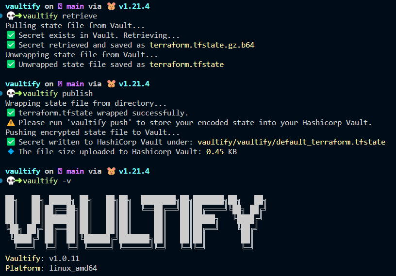

<!-- // ########################################################################################
// # ██████╗ ██╗   ██╗██╗   ██╗███╗   ██╗     ██████╗ ██████╗  ██████╗ ██╗   ██╗██████╗   #
// # ██╔══██╗██║   ██║██║   ██║████╗  ██║    ██╔════╝ ██╔══██╗██╔═══██╗██║   ██║██╔══██╗  #
// # ██████╔╝██║   ██║██║   ██║██╔██╗ ██║    ██║  ███╗██████╔╝██║   ██║██║   ██║██████╔╝  #
// # ██╔══██╗██║   ██║██║   ██║██║╚██╗██║    ██║   ██║██╔══██╗██║   ██║██║   ██║██╔═══╝   #
// # ██████╔╝╚██████╔╝╚██████╔╝██║ ╚████║    ╚██████╔╝██║  ██║╚██████╔╝╚██████╔╝██║       #
// # ╚═════╝  ╚═════╝  ╚═════╝ ╚═╝  ╚═══╝     ╚═════╝ ╚═╝  ╚═╝ ╚═════╝  ╚═════╝ ╚═╝       #
// # Author: Sacha Roussakis-Notter														                            #
// # Project: Vaultify																	                                  #
// # Description: Easily push, pull and encrypt tofu and terraform statefiles from Vault. #
// ######################################################################################## -->

<div align="center">
    
</div>


```bash
██╗   ██╗ █████╗ ██╗   ██╗██╗  ████████╗██╗███████╗██╗   ██╗
██║   ██║██╔══██╗██║   ██║██║  ╚══██╔══╝██║██╔════╝╚██╗ ██╔╝
██║   ██║███████║██║   ██║██║     ██║   ██║█████╗   ╚████╔╝ 
╚██╗ ██╔╝██╔══██║██║   ██║██║     ██║   ██║██╔══╝    ╚██╔╝  
 ╚████╔╝ ██║  ██║╚██████╔╝███████╗██║   ██║██║        ██║   
  ╚═══╝  ╚═╝  ╚═╝ ╚═════╝ ╚══════╝╚═╝   ╚═╝╚═╝        ╚═╝   
                                                            
```

# Introduction 🙋

Welcome to Vaultify, the versatile CLI tool designed to simplify the management of your statefiles while ensuring their security. Vaultify empowers DevOps teams and infrastructure engineers to seamlessly encrypt, store, and retrieve statefiles in HashiCorp Vault. Whether you're automating CI/CD pipelines or collaborating with a team, Vaultify provides the tools you need to protect sensitive data and streamline your workflows.

To learn more you can visit the [Vaultify](https://vaultify.buungroup.com) website.

> NOTE: You can also refer to vaultify documentation at [Vaultify](https://vaultify.buungroup.com).

In summary, `Vaultify` empowers you to optimize your Terraform state management, reducing costs, enhancing security, and simplifying automation, all while eliminating limitations imposed by traditional approaches. Reduce the complexity by running `Vaultify` as your `Hashicorp Vault` state manager.

### Get Started

Please refer to [Vaultify](https://vaultify.buungroup.com) for documentation..

Before using `Vaultify`, make sure your system meets the following requirements:

1. **Linux Operating System**: `Vaultify` is currently supported only on Linux-based operating systems.

2. **Dependencies**:
   - **curl**: `Vaultify` requires the `curl` command-line tool to interact with HashiCorp Vault. You can install it using your system's package manager.
   - **gzip**: The `gzip` utility is used for compressing state files. Ensure it is installed on your system.
   - **jq**: The `jq` utility is used for querying json data. Ensure it is installed on your system.

Alternatively you can run the `make` command, to install all the requirements.

Before you can run this `make` must be installed this can be installed with the following command:

```bash
sudo apt-get install make -y
```

Command Usage:
```bash
make
```

3. **Terraform or Opentofu**: `Vaultify` expects either Terraform or Opentofu to be installed on your system. These are used for managing infrastructure and Terraform state files. Install one of these tools based on your needs.

Please ensure that you have these requirements fulfilled on your system before using `Vaultify`.

---

# Install Vaultify 🔨


Run the following commands for installation of Vaultify:

### curl

```bash
curl --proto '=https' --tlsv1.2 -fsSL https://raw.githubusercontent.com/DFW1N/vaultify/main/scripts/install-vaultify.sh | sudo bash
```

### wget

```bash
wget --https-only -O - https://raw.githubusercontent.com/DFW1N/vaultify/main/scripts/install-vaultify.sh | sudo bash
```

> NOTE: If you still cant run `vaultify` commands try refreshing your terminal.

`bin/bash`
```bash
source $HOME/.bashrc
```

`zsh`
```bash
source $HOME/.zshrc
```

---

### Docker Install

**Buun Group** [Docker Hub](https://hub.docker.com/r/buungroup/vault-raft), to view repository tags.

Install `Docker` if not installed locally (Supported only for `Ubuntu/Debian` / `Fedora/Red Hat`).

```bash
git clone https://github.com/DFW1N/vaultify.git && cd docker/scripts && chmod +x install-docker.sh
./install-docker.sh
```

Run the following commands to install `Vaultify` with a deployed `Hashicorp Vault` locally:

```bash
vaultify install-vault
```

<!-- Install using `apt-get`

Add 
```bash
wget -O- https://vaultify.buungroup.com/public/gpg | sudo gpg --dearmor -o /usr/share/keyrings/vaultify-archive-keyring.gpg
echo "deb [signed-by=/usr/share/keyrings/vaultify-archive-keyring.gpg] https://apt.vaultify.com $(lsb_release -cs) main" | sudo tee /etc/apt/sources.list.d/vaultify.list
``` -->

---

# Documentation 📖

You can find more information on `VAULTIFY CLI` documentation at [Vaultify](https://vaultify.buungroup.com/#/CLI) file for details, this section covers the logic of each command and what exactly it is doing.

---

## Vaultify - A CLI Tool for Managing Statefiles 🔐

Vaultify is a command-line interface (CLI) tool for managing statefiles, particularly for Terraform projects. It provides functionality to interact with HashiCorp Vault, including secret encryption and pushing/pulling state from a remote Vault server.

## Commands

Vaultify supports the following commands:

| Command                                 | Description                                |
|-----------------------------------------|--------------------------------------------|
| [`vaultify init`](https://vaultify.buungroup.com/#/cli/INIT.md) | Initialize Vaultify in your operating system.                                                                    |
| [`vaultify validate`](https://vaultify.buungroup.com/#/cli/VALIDATE.md) | Vaultify will validate your `terraform.tfstate` file JSON.                                                         |
| [`vaultify compare`](https://vaultify.buungroup.com/#/cli/COMPARE.md) | Vaultify will compare your local `terraform.tfstate` file JSON to your remote Vault `terraform.tfstate` file.  |
| [`vaultify update`](https://vaultify.buungroup.com/#/cli/UPDATE.md) | Update Vaultify to the latest version.                                                                           |
| [`vaultify wrap`](https://vaultify.buungroup.com/#/cli/WRAP.md) | Encrypts and encodes Terraform statefiles for secure storage in HashiCorp Vault.                                |
| [`vaultify unwrap`](https://vaultify.buungroup.com/#/cli/UNWRAP.md) | Decrypts and decodes Terraform statefiles, retrieving them from HashiCorp Vault for use.                       |
| [`vaultify delete`](https://vaultify.buungroup.com/#/cli/DELETE.md) | Delete the HashiCorp secret from Vault.                                                                         |
| [`vaultify path`](https://vaultify.buungroup.com/#/cli/PATH.md) | Display the HashiCorp secret path used to store statefiles.  
| [`vaultify retrieve`](https://vaultify.buungroup.com/#/cli/RETRIEVE.md) | Combines pull and unwrap together to speed up state existence.                                                   |
| [`vaultify permissions`](https://vaultify.buungroup.com/#/cli/PERMISSIONS.md) | It will validate the policies on your token, then attempt to create a test secret on your engine type you have as default it will either suceed or fail.                                                   |
| [`vaultify publish`](https://vaultify.buungroup.com/#/cli/PUBLISH.md) | Combines wrap and push together to speed up pushing your state to Hashicorp Vault.                                                   |
| [`vaultify pull`](https://vaultify.buungroup.com/#/cli/PULL.md) | Pulls encrypted data from HashiCorp Vault and decodes it, making it accessible for local use.                    |
| [`vaultify push`](https://vaultify.buungroup.com/#/cli/PUSH.md) | Pushes encrypted data, such as Terraform statefiles, into HashiCorp Vault, allowing for centralized and secure storage. |
| [`vaultify status`](https://vaultify.buungroup.com/#/cli/STATUS.md) | Checks if Vaultify is still authenticated to HashiCorp Vault.                                                     |
| [`vaultify install-vault`](https://vaultify.buungroup.com/#/cli/INSTALL-VAULT.md) | Vaultify will automatically setup and deploy your developer Hashicorp Vault                                                     |
| [`vaultify delete-vault`](https://vaultify.buungroup.com/#/cli/DELETE-VAULT.md) | Vaultify will automatically delete your developer or test Hashicorp Vault                                                     |
| [`vaultify configure`](https://vaultify.buungroup.com/#/cli/CONFIGURE.md) | Configures the Vaultify project, allowing customization of settings such as the Vault address, authentication method, and data paths. |
| [`vaultify -v, --version`](https://vaultify.buungroup.com/#/cli/VERSION.md) | Show the Vaultify version.                                                                                      |
| [`vaultify -h, --help`](https://vaultify.buungroup.com/#/cli/HELP.md)    | Show this help message.                                                                                         |


## Usage ⭐

To use Vaultify, simply execute one of the commands listed above. For example, to initialize Vaultify, you can run:

```bash
vaultify <command>
```

> NOTE: Vaultify uses your `Working Directory Base` name and `Terraform Workspace` name to dynamically build your vault secret path to publish the encoded state file to.

### Example Usage



In this example, I'm simply pulling an existing state file, in my `Hashicorp Vault`, unwrapping it then ideally you would run your `terraform` commands here update the statefile then run `vaultify wrap` then `vaultify push` to renew your state with the changes in your `Hashicorp Vault`.

---
---

## Bugs/Errors 💣

Please keep in mind this product is brand new and has not been tested actively and throughly, if you encounter errors or issues please raise a PR or raise a issue refer to [ISSUE TEMPLATE](.github/ISSUE_TEMPLATE/vaultify_issue_report.md) for more information on submission, thank you.

---

# Required Environment Variables

| Description                         | Environment Variable | Required |
|-------------------------------------|----------------------|----------|
| Vault token for authentication     | `VAULT_TOKEN`        | Yes      |
| Vault server address for connection | `VAULT_ADDR`         | Yes  

In summary, the Vault token and Vault address are fundamental authentication parameters that Vaultify relies on to securely interact with HashiCorp Vault. Ensuring that these parameters are correctly configured is essential for Vaultify to perform its actions effectively while maintaining the security of your secrets and statefiles.

---

## Contributing ⌛

This section covers how to contrinute to this project  see the [CONTRIBUTING](CONTRIBUTING.md) file for details.

---

## Author 🔥

| Vaultify                  |
| ----------------------- |
| **Sacha Roussakis-Notter** |
| *Maintainer and Creator* |

---

## License 📃

This project is licensed under the `GNU General Public License, Version 3 (GPL-3.0)` - see the [LICENSE](LICENSE) file for details.